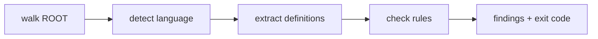

# How checking works

A run is a straight pipeline: discover files, extract names, check names,
report. This page explains each stage and the design choices behind it.

## 1. Discovery

`dddlint lint` walks `ROOT` recursively, skipping generated and vendored
directories (`.git`, `.venv`, `node_modules`, `__pycache__`, `target`, `dist`,
`build`). Every remaining file is offered to language detection.

## 2. Language detection

Each file's suffix is mapped to a tree-sitter language via
`tree-sitter-language-pack`. Files with no recognised language are skipped
silently, so a repository can mix 306 languages and plain text without
configuration. The grammar is downloaded on first use and cached.

## 3. Extraction

The recognised source is parsed and flattened into a list of `Definition`
records, one per class, function, method, struct, interface, enum, trait,
variable, or constant. dddlint deliberately reads only **names** (plus their
location), never bodies. That is what keeps it language-agnostic: it never
needs a per-language query, only the universal notion of "a named definition".

## 4. Tokenisation

Every name is split into lowercase tokens on case and separator boundaries.
`OrderManager`, `order_manager`, and `ORDER_MANAGER` all tokenise to
`("order", "manager")`. Rules match on tokens, which is why they are
case-insensitive and naming-convention-agnostic by construction.

## 5. Rule evaluation

Two independent passes run over the definitions:

- **Per-definition**: for each name, check its tokens against the forbidden
  set and the alias map that apply to that file's path.
- **Cross-codebase drift**: group every name by its sorted token set; any group
  with more than one distinct spelling is a drift finding.

The config file is also checked against itself in the same run, so a
contradictory vocabulary surfaces before it can mask real findings.

## Scope precedence

Forbidden terms and alias maps are assembled per file in a fixed order:

1. **Global** rules are always included.
2. **Domain** rules are merged in when the file path matches the domain's
   `include` globs.
3. **Context** rules are merged in last, so a context can override a domain.

Because the layers are *merged*, a domain or context can only ever add rules or
override an alias mapping for its files. It can never switch off a global rule.
"Context wins" falls out of ordering: the last writer of an alias mapping is the
one that takes effect.

## Why scan the whole workspace every time

Drift is a property of the whole codebase, not a single file. You cannot know
that `getUser` and `get_user` disagree by looking at either one alone. So both
`dddlint lint` and the [LSP server](../how-to/editor-lsp.md) always scan the
entire tree, even when the editor only asked about one open file. It costs more
per run and guarantees drift is never missed.

## The exit code as an interface

Everything the CLI does reduces to one bit at the boundary: `0` for clean, `1`
for findings. That single contract is what lets the same binary drop into a
[CI job](../how-to/ci.md), a [pre-commit hook](../how-to/pre-commit.md), and a
coding agent's feedback loop without any of them knowing anything about DDD.
