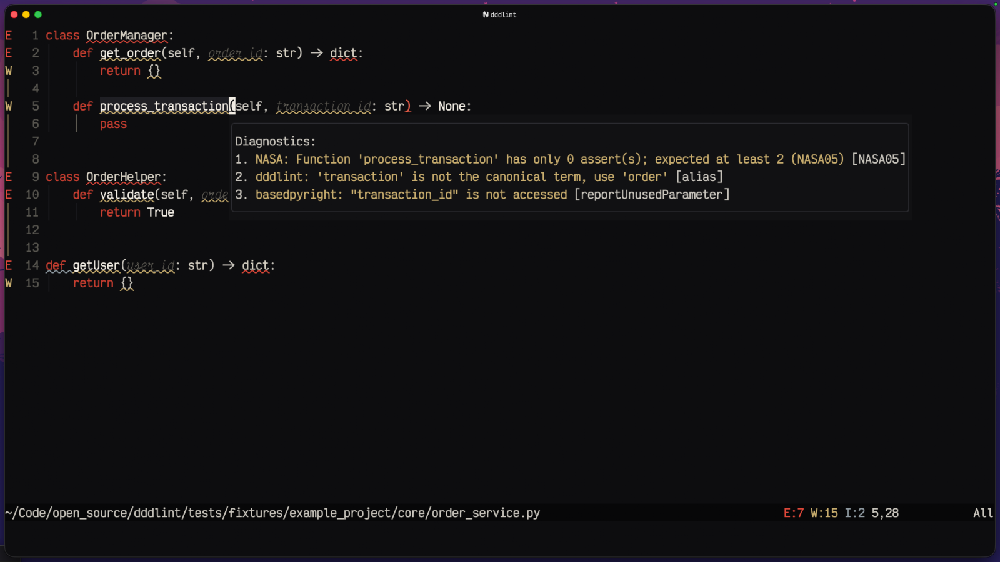

# dddlint

**Polyglot ubiquitous language linter for codebases and coding agents.**

dddlint reads class, function, method, and type names across **306 languages**
and enforces them against a domain vocabulary: banned terms, non-canonical
synonyms, and one concept spelled several ways.

It works with any language tree-sitter recognises, without per-language
queries. It slots into pre-commit hooks, CI pipelines, and coding-agent loops
via a non-zero exit code on findings, and ships an LSP server for inline editor
diagnostics with rename code actions.

{ loading=lazy }

## The idea in one example

A team agrees `order` is the canonical term. Someone commits a
`process_transaction` method. dddlint flags it in CI, in a commit hook, or
right in the editor, and suggests the rename to `process_order`.

```yaml title="dddlint.yaml"
synonyms:
  - canonical: order
    aliases: [purchase, transaction]
forbidden: [util, helper, manager]
```

```sh
dddlint lint src/
```

## Beyond spelling

Token rules only catch the words you thought to write down. `dddlint map`
embeds every definition name and compares meaning instead, so
`fetch_order` and `retrieve_purchase` surface as the same idea worded twice
even though they share no token, and a name whose vocabulary belongs to
another bounded context gets flagged where it sits.

```sh
dddlint map src/
```

## Where to go next

This documentation follows the [Diátaxis](https://diataxis.fr) framework.

<div class="grid cards" markdown>

- :lucide-graduation-cap: **[Tutorial](tutorials/getting-started.md)**

    Learning-oriented. Lint your first project from scratch.

- :lucide-wrench: **[How-to guides](how-to/ci.md)**

    Task-oriented. Wire dddlint into CI, pre-commit, and your editor.

- :lucide-book: **[Reference](reference/cli.md)**

    Information-oriented. Every CLI command, config key, and rule.

- :lucide-lightbulb: **[Explanation](explanation/ubiquitous-language.md)**

    Understanding-oriented. Why a language linter, and how it decides.

</div>
