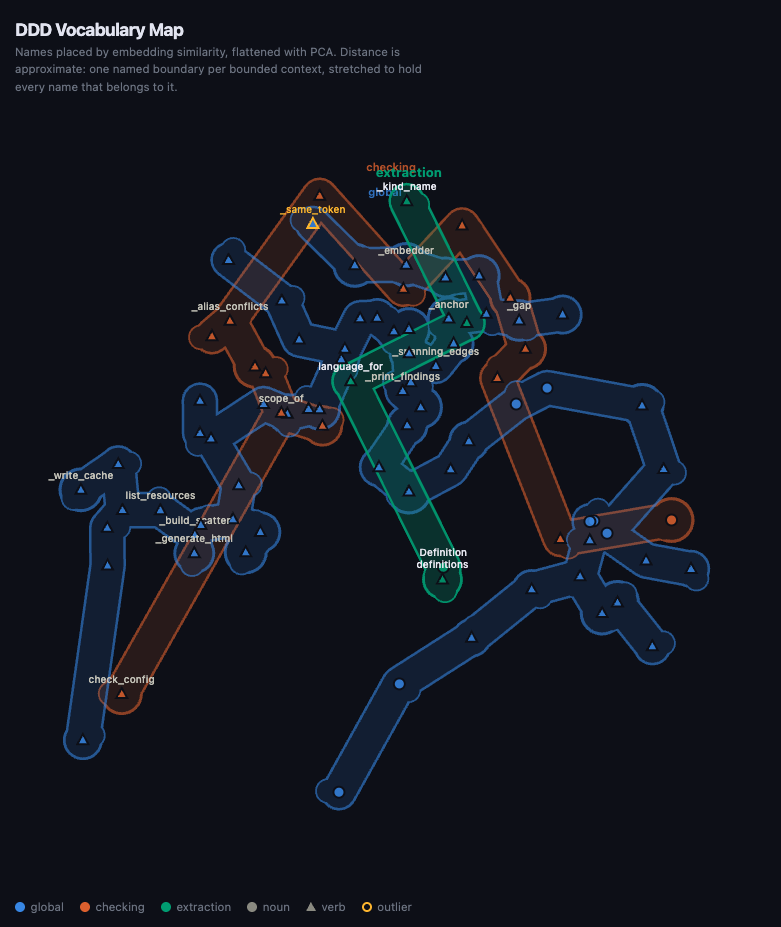

# CLI reference

Installed as `dddlint`. Every command auto-detects each file's language and
downloads the tree-sitter grammar on first use, so there is nothing to configure.

```sh
dddlint [OPTIONS] COMMAND [ARGS]
```

## Global options

| Option | Description |
|---|---|
| `-v`, `--version` | Print the version and exit |
| `-h`, `--help` | Show help and exit |

## `lint`

Lint a codebase for ubiquitous-language violations.

```sh
dddlint lint [ROOT] [--config PATH]
```

| Argument / option | Default | Description |
|---|---|---|
| `ROOT` | current directory | Directory to scan recursively |
| `--config PATH` | `ROOT/dddlint.yaml` | Config file to load |

Config resolution: if `--config` is omitted, dddlint looks for `dddlint.yaml`
in `ROOT`, then falls back to the current working directory.

Directories skipped while scanning: `.git`, `.venv`, `node_modules`,
`__pycache__`, `target`, `dist`, `build`. On top of those, dddlint honours the
config's [`exclude`](config.md#exclude-patterns) patterns and any `.gitignore`
beside the config file. Both are matched relative to the config file's
directory, so `dddlint lint src/billing` still respects patterns written
relative to the project root.

Directory and module names are linted alongside the definitions, as
[`forbidden:module` and `alias:module`](rules.md#forbiddenmodule-and-aliasmodule).

The config file itself is validated on every run (see the
[config rules](rules.md#config-rules)).

**Exit code**

| Code | Meaning |
|---|---|
| `0` | No findings |
| `1` | One or more findings (printed to stdout) |
| `2` | No config found at the resolved path |

## `init`

Write a starter `dddlint.yaml`.

```sh
dddlint init [ROOT]
```

| Argument | Default | Description |
|---|---|---|
| `ROOT` | current directory | Directory to write `dddlint.yaml` into |

The file lists the defaults with every list left empty, so it produces no
findings until you fill it in. Refuses to overwrite an existing config, exiting
`1` and leaving your file alone.

## `map`

Report project-level vocabulary insights from name embeddings.

```sh
dddlint map [ROOT] [--config PATH]
```

| Argument / option | Default | Description |
|---|---|---|
| `ROOT` | current directory | Directory to scan recursively |
| `--config PATH` | `ROOT/dddlint.yaml` | Config file to load |

`map` is the one command that needs an embedding backend, installed as an extra:
`dddlint[embed-local]` for a model that runs offline, or `dddlint[embed]` for a
hosted one such as `openai:text-embedding-3-small`. Without either, `map` exits
`2` naming the extra to install; `lint`, `html`, and `lsp` never embed anything.

Where `lint` compares names token by token, `map` embeds every definition name
and compares meaning, which catches the pairs that share an idea but no
spelling. Takes the same `ROOT` and `--config` arguments as `lint` and emits the
[insights](rules.md#insights), ordered by score:

```text
4 names
──────────────────────────────────────────────────────────────────
  1.00  near-synonym      fetch_order, retrieve_purchase  same idea, unrelated words: fetch_order, retrieve_purchase; pick one canonical term
  0.50  context-outlier   fetch_order  reads like core vocabulary but lives in billing

◆ 2 insights
```

The first run downloads the model from
[`embeddings.model`](config.md#embeddings) and writes vectors to
`embeddings.cache`; later runs only embed names that are new. Exits `0` whatever
it finds, so it informs rather than gates. Prints `no definitions found` on an empty tree.

Every run also writes a scatter plot of the vocabulary to `dddmap.html` beside
the config and opens it: names laid out by PCA so neighbours mean similar things, drawn as
triangles for verbs and dots for nouns. One named boundary wraps each bounded
context, stretched around every name that belongs to it, so a context is one
region however far PCA scatters its names. Names in files no `domains` or
`contexts` glob claims are `unassigned`: grey, dashed, and inside no boundary,
because they belong to no bounded context yet. Hovering a boundary brightens it and
labels every name inside; otherwise one name per cluster is labelled, outliers
always are, and zooming past 1.4 labels everything. Pan and zoom in the
browser.

{ loading=lazy }

```sh
dddlint map src/
```

## `html`

Open an interactive language graph in the browser.

```sh
dddlint html [ROOT] [--config PATH]
```

Renders the configured vocabulary (canonical terms, aliases, domains, and
contexts) to a temporary HTML file and opens it in your default browser. Takes
the same `ROOT` and `--config` arguments as `lint`.

## `lsp`

Start the Language Server over stdio.

```sh
dddlint lsp [ROOT]
```

Publishes diagnostics on file open and save, scanning the whole workspace each
time, and offers rename code actions for aliases. Wire it into an editor with
the [editor guide](../how-to/editor-lsp.md). Also available as the
`dddlint-lsp` entry point.
